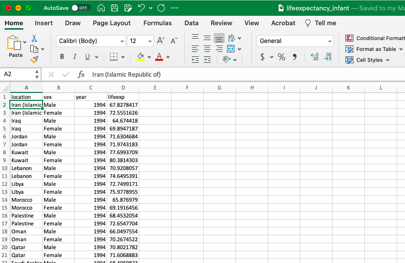
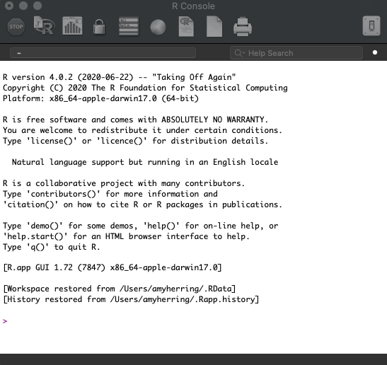
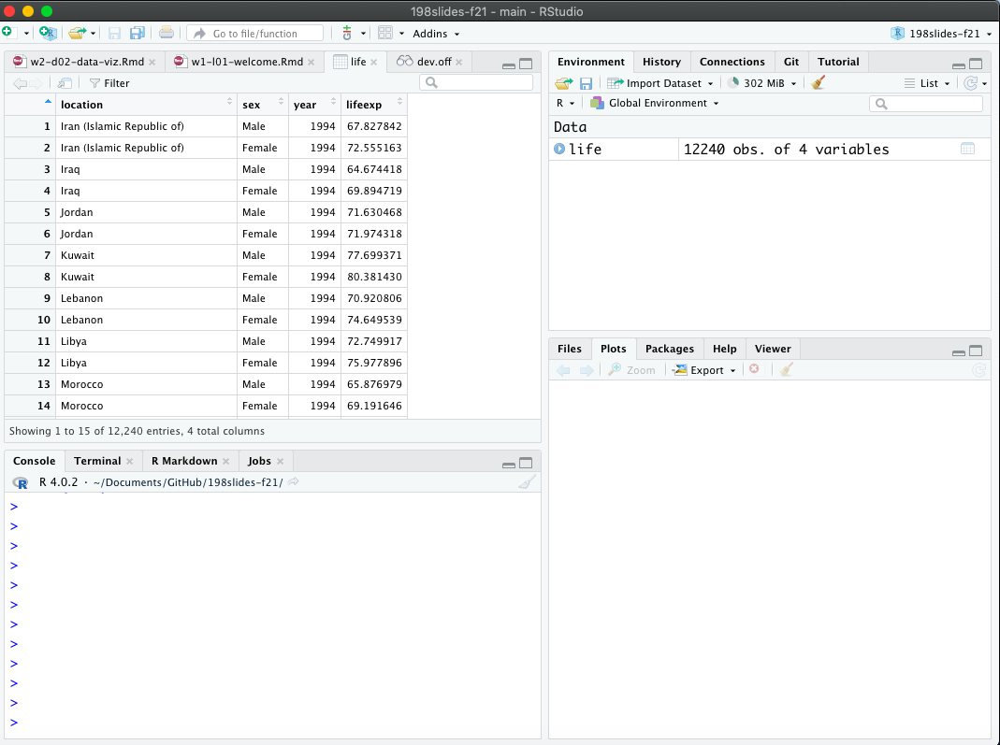

```{r child = "../../setup.Rmd"}
```

```{r packages, echo=FALSE, message=FALSE, warning=FALSE}
library(tidyverse)
#githubinstall("emo")
library(emo)
```


## Data science

.pull-left-wide[
- Data science is an exciting discipline that allows you to turn raw data into understanding, insight, and knowledge. 

- This is a course on health data science, with an emphasis on statistical thinking and global health challenges.

- Our process involves

  - forming a question of interest,
  - (collecting) and summarizing data,
  - and interpreting and communicating results.


]

---


## Global health data science

.pull-left-wide[

STA 198 will

- provide a tour of basic statistical methods useful in public health and biomedical research

- emphasize intuition and understanding of the methods, with a focus on critical assessment of evidence, data-driven decision-making, and effective communication of insights from data

- make use of timely, relevant examples from global health science

- utilize free, modern software and reproducible research methods for transparency and data sharing.

]

---

## Course FAQ

.pull-left-wide[
**Q - What data science background does this course assume?**  
A - None.

**Q - Is this an intro stat course?**  
A - While statistics $\ne$ data science, they are very closely related and have tremendous of overlap. Hence, this course is a great way to get started with statistics. However this course is *not* your typical high school statistics course.

**Q - Will we be doing computing?**   
A - Yes, extensively.
]

---

## Course FAQ

.pull-left-wide[
**Q - Is this an intro CS course?**  
A - No, but many themes are shared.

**Q - What computing language will we learn?**  
A - R.

**Q: Why not language X?**  
A: We can discuss that over `r emo::ji("coffee")`.
]

---

## Course info online...

... where you can find everything except your grades!

<br>

AMY UPDATE LINK

.larger[
.center[
[**introds.org**](https://introds.org/)
]
]

---

class: middle

# Software

---

```{r echo=FALSE, out.width="75%", fig.align="left"}

```

---

```{r echo=FALSE, out.width="60%", fig.align="left"}

```

---

```{r echo=FALSE, out.width="73%", fig.align="left"}

```

---

class: middle

# Data science life cycle

---

```{r echo=FALSE, out.width="90%", fig.align="left"}
knitr::include_graphics("img/data-science-cycle/data-science-cycle.001.png")
```

---

```{r echo=FALSE, out.width="90%", fig.align="left"}
knitr::include_graphics("img/data-science-cycle/data-science-cycle.002.png")
```

---

```{r echo=FALSE, out.width="90%", fig.align="left"}
knitr::include_graphics("img/data-science-cycle/data-science-cycle.003.png")
```

---

```{r echo=FALSE, out.width="90%", fig.align="left"}
knitr::include_graphics("img/data-science-cycle/data-science-cycle.004.png")
```

---

```{r echo=FALSE, out.width="90%", fig.align="left"}
knitr::include_graphics("img/data-science-cycle/data-science-cycle.005.png")
```

---


```{r echo=FALSE, out.width="90%", fig.align="left"}
knitr::include_graphics("img/data-science-cycle/data-science-cycle.006.png")
```

---

```{r echo=FALSE, out.width="90%", fig.align="left"}
knitr::include_graphics("img/data-science-cycle/data-science-cycle.007.png")
```

---

```{r echo=FALSE, out.width="90%", fig.align="left"}
knitr::include_graphics("img/data-science-cycle/data-science-cycle.009.png")
```

---

```{r echo=FALSE, out.width="65%", fig.align="left"}

```

A study at Penn (Chen et al, 2008) found that men presenting at emergency departments with acute nontraumatic abdominal pain received painkillers more quickly than women. 

---


class: middle

# Let's dive in!


---

## Men's Health Gap

.pull-left-wide[

- Health gaps are differences in the prevalence of disease, access to healthcare, or health outcomes across different groups.

- The earlier slide highlighted a small (n $\approx$ 900) study in one emergency room that showed men were more likely to receive painkillers, and received them more quickly, than women.

- Mortality data and life expectancy from infancy tell a different story.

]

---

## Dilemma: Measurement of Gender Minorities

.pull-left-wide[
- Research on health gaps among gender minorities is limited due to a variety of factors, including

  - binary gender construction,
  - pre-populated vs. open-field survey items,
  - and many others
  
- These measurement issues lead to misclassification and impede research on important health issues affecting gender minorities

- Once data are collected, analysts may have limited options (survey design is critical!)

]

---

## Life Expectancy

- The [Institute for Health Metrics and Evaluation (IHME)](http://www.healthdata.org) is a resource for data on a variety of important health outcomes worldwide. 

- IHME maintains the [Global Burden of Disease (GBD)](http://ghdx.healthdata.org) tool, a valueable resource for policymakers and others that quantifies health loss due to a variety of risk factors, diseases, and injuries.

- We consider data from IHME on (estimated) infant life expectancy from the years 1994-2019 as a function of location (primarily country) and binary gender. 

- Here **life expectancy** is the \# of years an infant can expect to live if mortality rates in the current year remain unchanged for the rest of their life. Life expectancy usually underestimates how long the baby will actually live, as mortality rates have been declining over time.


---

# What is in a dataset?

---

## Dataset terminology

- Each row is an **observation**
- Each column is a **variable**

.small[

```{r message=FALSE}
life <- readr::read_csv("lifeexp/lifeexpectancy_infant.csv")

life
```

]

---


## What's in the life expectancy data?

Take a `glimpse` at the data:

```{r}
glimpse(life)
```

---

.question[
How many rows and columns does this dataset have?
What does each row represent?
What does each column represent?
]


---

.question[
How many rows and columns does this dataset have?
]

.pull-left[
```{r}
nrow(life) # number of rows
ncol(life) # number of columns
dim(life)  # dimensions (row column)
```
]

---

class: middle

# Exploratory data analysis

---

## What is EDA?

- Exploratory data analysis (EDA) is an approach to analysing data sets to summarize its main characteristics
- Often, this is visual -- this is what we'll focus on first
- But we might also calculate summary statistics and perform data wrangling/manipulation/transformation at (or before) this stage of the analysis -- this is what we'll focus on next

---

## Life expectancy over time

.question[ 
How would you describe the relationship between year and life expectancy?
What other variables would help us understand data points that don't follow the overall trend?
What is causing the **outliers** at the bottom?
]

```{r fig.width = 8, warning = FALSE, echo=FALSE, out.width = "50%"}
life %>%
    ggplot(aes(x = year, y = lifeexp,shape=sex))+geom_point()+labs(title = "Life expectancy over time",
       x = "Year", y = "Life Expectancy (Years)") 
```

Ok, ugly plot!  We'll break it down soon -- but first, the outliers....

---

```{r outliers}
# we want to look at the bottom 5 values of life expectancy (5 just in case some points are exactly the same)
life %>% top_n(-5,lifeexp)
```

Are these data errors, realistic estimates, or neither?  (Hint: recall how life expectancy is calculated)

---


class: middle

# Data visualization

---

## Data visualization

> *"The simple graph has brought more information to the data analyst's mind than any other device." --- John Tukey*

- Data visualization is the creation and study of the visual representation of data
- Many tools for visualizing data -- R is one of them
- Many approaches/systems within R for making data visualizations -- **ggplot2** is one of them, and that's what we're going to use

---

## ggplot2 $\in$ tidyverse

.pull-left[
```{r echo=FALSE, out.width="80%"}
knitr::include_graphics("img/ggplot2-part-of-tidyverse.png")
```
] 
.pull-right[ 
- **ggplot2** is tidyverse's data visualization package 
- `gg` in "ggplot2" stands for Grammar of Graphics 
- Inspired by the book **Grammar of Graphics** by Leland Wilkinson
]

---

## Grammar of Graphics

.pull-left-narrow[
A grammar of graphics is a tool that enables us to concisely describe the components of a graphic
]
.pull-right-wide[
```{r echo=FALSE, out.width="100%"}
knitr::include_graphics("img/grammar-of-graphics.png")
```
]

.footnote[ Source: [BloggoType](http://bloggotype.blogspot.com/2016/08/holiday-notes2-grammar-of-graphics.html)]

---

## Men's gap in life expectancy by year

Let's subset to a few countries to de-clutter the plot.

```{r lifeexp, fig.width = 8, out.width = "50%"}
life %>%
  filter(location %in% c("United States of America","Rwanda","China")) %>%
      ggplot(aes(x = year, y = lifeexp,shape=sex,color=location))+geom_point()

```

We'll learn to make this a lot better later!

---


.question[ 
- What are the functions doing the plotting?
- What is the dataset being plotted?
- Which variables map to which features (aesthetics) of the plot?
]

```{r ref.label="lifeexp", fig.show = "hide"}
```


---

## Hello ggplot2!

.pull-left-wide[
- `ggplot()` is the main function in ggplot2
- Plots are constructed in layers
- Structure of the code for plots can be summarized as

```{r eval = FALSE}
ggplot(data = [dataset], 
       mapping = aes(x = [x-variable], y = [y-variable])) +
   geom_xxx() +
   other options
```

- The ggplot2 package comes with the tidyverse

```{r}
library(tidyverse)
```

- For help with ggplot2, see [ggplot2.tidyverse.org](http://ggplot2.tidyverse.org/)
]

---

class: middle

# Why do we visualize?

---

## Anscombe's quartet/datasaurus dozen

```{r datasaur-for-show, eval = TRUE, echo = FALSE}
library(datasauRus)
```

.pull-left[
```{r datasaur-view1, echo = FALSE}
datasaurus_dozen %>%
  filter(dataset=="dino") %>%
  print
datasaurus_dozen %>%
  filter(dataset=="star") %>%
  print
```
] 
.pull-right[
```{r datasaur-view2, echo = FALSE}
datasaurus_dozen %>%
  filter(dataset=="bullseye") %>%
  print
datasaurus_dozen %>%
  filter(dataset=="dots") %>%
  print
```
]

---

## Summarising Anscombe's quartet/datasaurus dozen

```{r pkgadd,echo=FALSE}
library(gganimate)
```

```{r dozen-summary, eval=FALSE}
summdat=datasaurus_dozen %>%
  group_by(dataset) %>%
  summarise(
    mean_x = mean(x), 
    mean_y = mean(y),
    sd_x = sd(x),
    sd_y = sd(y),
    r = cor(x, y)
  )
```


---

## Summarising Anscombe's quartet/datasaurus dozen

```{r dozen-summary2, echo=FALSE}
summdat=datasaurus_dozen %>%
  group_by(dataset) %>%
  summarise(
    mean_x = mean(x), 
    mean_y = mean(y),
    sd_x = sd(x),
    sd_y = sd(y),
    r = cor(x, y)
  )
print(summdat,n=13)
```

---

## Visualizing the data

```{r quartet-plot, echo = FALSE, out.width = "80%", fig.asp = 0.5}

ggplot(datasaurus_dozen, aes(x=x, y=y))+
  geom_point()+
  theme_minimal() +
  transition_states(dataset, 3, 1) + 
  ease_aes('cubic-in-out')


```


<!--

ggplot(quartet, aes(x = x, y = y)) +
  geom_point() +
  facet_wrap(~ set, ncol = 4)
  
life %>%
    ggplot(aes(x = year, y = lifeexp))+geom_point()

 let's see what's going on with the low outliers
life %>% top_n(-5,lifeexp)

life %>%
  filter(location %in% c("United States of America","Rwanda","China")) %>%
      ggplot(aes(x = year, y = lifeexp))+geom_point()
      
# our country name looks too long
life[["location"]] <-life[["location"]] %>%
  str_replace( pattern = "United States of America", replacement = "USA")

life %>%
  filter(location == "USA") %>%
      ggplot(aes(x = year, y = lifeexp))+geom_point()

life %>%
  filter(location=="USA") %>%
      ggplot(aes(x = year, y = lifeexp,group=sex))+geom_point()+geom_line(aes(color=sex))


life %>%
  filter(location %in% c("USA","Rwanda","China")) %>%
      ggplot(aes(x = year, y = lifeexp,group=sex))+geom_point()+geom_line(aes(color=sex)) + facet_grid(location ~ .)

life %>%
  filter(location %in% c("USA","Brazil","China")) %>%
      ggplot(aes(x = year, y = lifeexp,group=sex))+geom_point()+geom_line(aes(color=sex)) + facet_grid(location ~ .)

life %>%
  filter(location %in% c("USA","Brazil","China")) %>%
      ggplot(aes(x = year, y = lifeexp,group=location))+geom_point()+geom_line(aes(color=location)) + facet_grid(sex ~ .)
      
      
# compare male vs female life expectancy

      
life %>%
  filter(year == '2019') %>%
     spread(sex,lifeexp) %>%
      ggplot(aes(x=Female,y=Male))+geom_point()+
      xlab("Female Life Expectancy (Years)")+ ylab("Male Life Expectancy (Years)") + ggtitle ("2019 Life Expectancy")
      
#add line with slope 1 intercept 0      
life %>%
  filter(year == '2019') %>%
     spread(sex,lifeexp) %>%
      ggplot(aes(x=Female,y=Male))+geom_point()+
      xlab("Female Life Expectancy (Years)")+ ylab("Male Life Expectancy (Years)") + ggtitle ("2019 Life Expectancy")+geom_abline(intercept=0,slope=1)
      
#points below line female life expectancy > male
#what are the points above the line?

life %>%
  filter(year == '2019') %>%
     spread(sex,lifeexp) %>%
       top_n(-3,Female-Male)


#is men's health gap increasing over time?
# to get decent scatter plot graph women life exp vs men
#in a single year
#calculate women-men for a country in each year
#need then to manipulate data to put on one row -- future lab on wrangling?

-->
