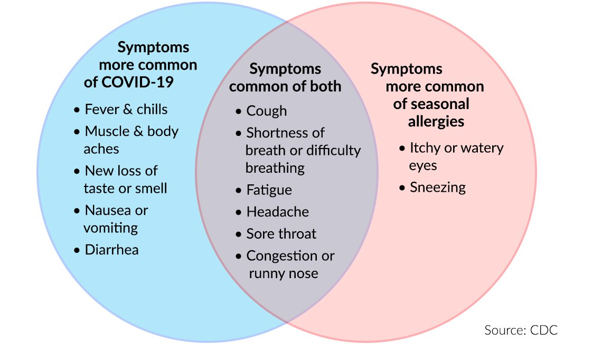

```{r child = "../../setup.Rmd"}
```

```{r packages, echo=FALSE, message=FALSE, warning=FALSE}
library(tidyverse)

```

class: middle

# Goal

---

## Goal of statistics

One goal of **statistics** is to make **inferences** about a **population** based on data in one or more **samples**.
- Population: the entire group we would like to make conclusions about (e.g., all people aged 15 and up in China, all pregnancies worldwide)
- Sample: specific group we have collected data from (e.g., a random sample of non-institutionalized people aged 15 and up in sampled households, from sampled villages from sampled counties; pregnancies receiving prenatal care at Duke)
- The validity of our inferences depends on a variety of factors, including the **representativeness** of our sample

**Statistical inference** is built upon the foundation of **probability theory**.


---

### Data

We consider data from the Global Adult Tobacco Survey (GATS). Because of strongly gendered cultural norms around smoking in China, we will focus on smoking behavior as well as interviewer-identified binary gender.

---


### Data

## Selected variables

<br>

.midi[
variable        | description
----------------|-------------
`CURRENTSMOKE`      |	yes, no, or don't know
`AGE` |	computed from date of birth
`EDUCATION`	          | highest level of education completed
`GENDER`	          | interviewer instructions were "Record gender from observation. Ask if necessary"; options for male, female, missing/NA
`PROVINCE`       |	residence of the individual
]

Other data are also available in the file. Sample survey weights are not included but should be used to obtain nationally-representative estimates (our estimates are fairly close for the quantities we consider today).
---

class: middle

# Operations on Events

---


## Events

An **event** is the basic element to which probability is applied, e.g. the result of an observation or experiment.

- **A** is the event that a person is a cigarette smoker
- **B** is the event that a person identifies as female
- **C** is the event that a person has blood type A+

A **sample space** is the set of all possible outcomes.


## Operations on Events

- The **union** of A and B, denoted $A \cup B$, is the event that A, or B, or both A and B, occur. Here, $A \cup B$ is the event that a person identifies as female, or is a smoker, or both.

- The **intersection** of A and B, denoted $A \cap B$, is the event that both A and B occur. Here $A \cap B$ is the event that a person both identifies as female and is a smoker. A and B are **disjoint** or **mutually exclusive** if $A \cap B = \emptyset$ (A and B can't occur simultaneously).

- The **complement** of A, denoted $A^c$ or $\overline{A}$, is the event A does not occur (nonsmoker). $A$ and $\overline{A}$ are **mutually exclusive** 

---

## Venn Diagram


```{r echo=FALSE, out.width="75%", fig.align="left"}

```
---

## Venn Diagram

```{r echo=FALSE, fig.align="left"}

```
---

## Probability

The **probability** of an event tells us how likely an event is to occur, and it can take values from 0 to 1, inclusive. It can be viewed as the proportion of times the event would occur if it could be observed an infinite number of times.

If we know the probability of $A$, often denoted $P(A)$, it is easy to calculate the probability of $\overline{A}$ as $P(\overline{A})=1-P(A)$. 

---

## Additive Rule of Probability

When events are mutually exclusive, $P(A\cup B)=P(A)+P(B)$.  When two events can occur simultaneously (think about runny nose in the Venn diagram), then we need to avoid double-counting when calculating the probability either of two events will occur. The general **additive rule of probability** is therefore $P(A \cup B)=P(A)+P(B)-P(A \cap B)$ -- because $A \cap B$ is part of the event A and part of the event B, we need to avoid double-counting it.

---

## Conditional Probability

Often we wish to know the probabilty an event will occur given that another event will occur.  For example, instead of knowing the probability of contracting COVID, we may wish to know the probability that someone will contract COVID given that they have been vaccinated. This is an example of a **conditional probability**. The conditional probability that someone is a smoker (A) given that they identify as female (B) is denoted $P(A|B)$.

---

## Simple Example

Suppose we have a small set containing 3 female non-smokers, 1 female smoker, 4 non-female non-smokers, and 4 non-female smokers.

If we feel this set is a sample representative of a population of interest, we can **estimate** the probability someone is a smoker as $\frac{1+4}{3+1+4+4}=0.42$.

We may be interested in the conditional probability someone is a smoker given that they identify as female, which we can estimate as $\frac{1}{3+1}$ -- we just change the denominator to correspond to our smaller population of interest.

## Conditional Probability

More formally, we define **conditional probability** as 
$P(A|B)=\frac{P(A \cap B)}{P(B)}$ (verify this in your own using the simple example figures).

Manipulating this formula, we get the **multiplicative rule of probability**: $P(A \cap B)=P(B)P(A|B)$.

---


